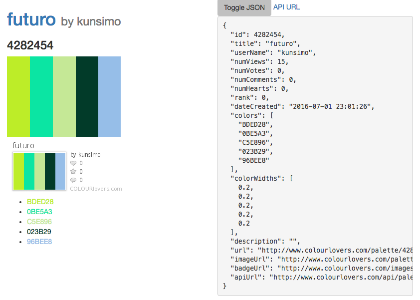

# What?

A simple, personal Angular 2 learning exercise which uses JSONP to get and use palettes and patterns from the http://colourlovers.com/ API.

This is not the best place from which to learn.  See instead, [the official guide to the Http Client](https://angular.io/docs/ts/latest/guide/server-communication.html), which I followed.

The basic application structure follows https://angular.io/docs/ts/latest/quickstart.html

## Installation:

    npm install
    npm run typings install

## Screenshot
Here's what it looks like if you ask for a colour-lovers component, specifying a specific palette id:

    <colour-lovers [paletteId]="4282454" ></colour-lovers>

